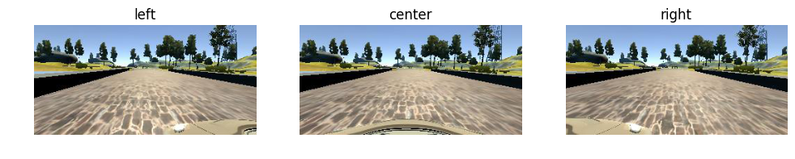
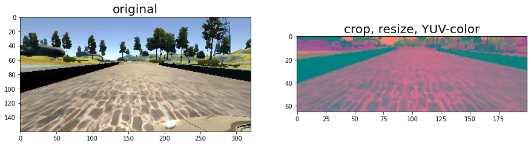
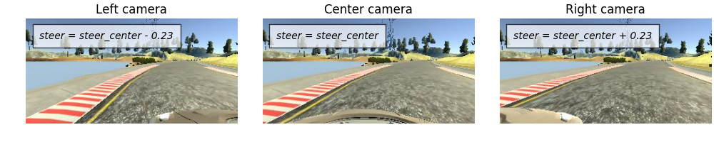
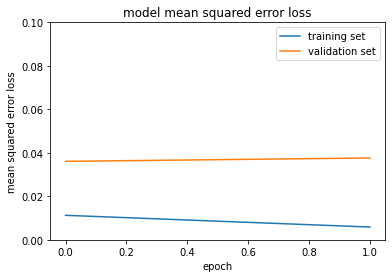

# Behavioral Cloning

Note: This project makes use of a Udacity-developed driving simulator and training data collected from the simulator (neither of which is included in this repo).

## Project Description

The objective is to apply for the deep learning principle to clone car driving behavior. It is a supervised regression problem between the car steering angles and the road images in front of a car. Those images were taken from three different camera angles which were in the center, the left and the right of the car. The neural network is based on [The NVIDIA model](https://devblogs.nvidia.com/parallelforall/deep-learning-self-driving-cars/), which has been proven to work in this problem domain. Not only did I apply for preprocessing of images, but the model is consisted of convolutional layers with Keras API.  

### Files included

- `model.ipynb` The script used to create and train the model.
- `drive.py` The script to drive the car
- `utils.py` The script to provide image preprocess and augumentation
- `model.h5` The model weights.

Note: drive.py is originally from [the Udacity Behavioral Cloning project GitHub](https://github.com/udacity/CarND-Behavioral-Cloning-P3) but it has been modified to control the throttle.

## Preparation 

### Install required python libraries:

You need an [anaconda](https://www.continuum.io/downloads) or [miniconda](https://conda.io/miniconda.html) to use the environment setting.

```python
# Use TensorFlow and config environment
conda env create -f environment.yml 
```

### Run the pretrained model

Start up [the Udacity self-driving simulator](https://github.com/udacity/self-driving-car-sim), choose a scene and press the Autonomous Mode button.  Then, run the model as follows:

```python
python drive.py model.h5
```

### To train the model

You'll need the data folder which contains the training images.

```python
!python model.ipynb
```

This will generate a file `model-<epoch>.h5` whenever the performance in the epoch is better than the previous best.  For example, the first epoch will generate a file called `model-000.h5`.

## Data Collection

I used the dataset provided by Udacity. About 8000 images. I did not record images myself. The dataset contains JPG images of dimensions 160x320x3. Here are some sample images from the dataset.


## Model Architecture Design

The design of the network is based on [the NVIDIA model](https://devblogs.nvidia.com/parallelforall/deep-learning-self-driving-cars/), which has been used by NVIDIA for the end-to-end self driving test.  As such, it is well suited for the project.  


It is a deep convolution network which works well with supervised image classification / regression problems.  As the NVIDIA model is well documented, I was able to focus how to adjust the training images to produce the best result with some adjustments to the model to avoid overfitting and adding non-linearity to improve the prediction.

I've added the following adjustments to the model. 

- I used Lambda layer to normalized input images to avoid saturation and make gradients work better.
- I've added an additional dropout layer to avoid overfitting after the convolution layers.
- I've also included ELU for activation function for every layer except for the output layer to introduce non-linearity.

- Image normalization (Lambda Layer)
- Convolution: 5x5, filter: 24, strides: 2x2, activation: ELU
- Convolution: 5x5, filter: 36, strides: 2x2, activation: ELU
- Convolution: 5x5, filter: 48, strides: 2x2, activation: ELU
- Convolution: 3x3, filter: 64, strides: 1x1, activation: ELU
- Convolution: 3x3, filter: 64, strides: 1x1, activation: ELU
- Drop out (0.5)
- Fully connected: neurons: 100, activation: ELU
- Fully connected: neurons:  50, activation: ELU
- Fully connected: neurons:  10, activation: ELU
- Fully connected: neurons:   1 (output)


The below is a model structure output from the Keras which gives more details on the shapes and the number of parameters.[`model.py`]

| Layer (type)                   |Output Shape      |Params  |Connected to     |
|--------------------------------|------------------|-------:|-----------------|
|lambda_1 (Lambda)               |(None, 66, 200, 3)|0       |lambda_input_1   |
|convolution2d_1 (Convolution2D) |(None, 31, 98, 24)|1824    |lambda_1         |
|convolution2d_2 (Convolution2D) |(None, 14, 47, 36)|21636   |convolution2d_1  |
|convolution2d_3 (Convolution2D) |(None, 5, 22, 48) |43248   |convolution2d_2  |
|convolution2d_4 (Convolution2D) |(None, 3, 20, 64) |27712   |convolution2d_3  |
|convolution2d_5 (Convolution2D) |(None, 1, 18, 64) |36928   |convolution2d_4  |
|dropout_1 (Dropout)             |(None, 1, 18, 64) |0       |convolution2d_5  |
|flatten_1 (Flatten)             |(None, 1152)      |0       |dropout_1        |
|dense_1 (Dense)                 |(None, 100)       |115300  |flatten_1        |
|dense_2 (Dense)                 |(None, 50)        |5050    |dense_1          |
|dense_3 (Dense)                 |(None, 10)        |510     |dense_2          |
|dense_4 (Dense)                 |(None, 1)         |11      |dense_3          |
|                                |**Total params**  |252219  |                 |

## Data Preprocessing

Images produced by the simulator in training mode are 320x160, and therefore require preprocessing prior to being fed to the CNN because it expects input images to be size 200x66. To achieve this, 

- the images are cropped so that the model won’t be trained with the sky and the car front parts
- the images are resized to 66x200 (3 YUV channels) as per NVIDIA model
- the images are normalized (image data divided by 127.5 and subtracted 1.0). 



## Model Training

### Image Augumentation

For training, I used the following augumentation technique along with **Python generator** to generate unlimited number of images:

- Randomly choose right, left or center images.
- For left image, steering angle is adjusted by +0.2
- For right image, steering angle is adjusted by -0.2
- Randomly flip image left/right
- Randomly translate image horizontally with steering angle adjustment (0.002 per pixel shift)
- Randomly translate image vertically
- Randomly added shadows
- Randomly altering image brightness (lighter or darker)

### Examples of Augmented Images


## Training, Validation and Test

I splitted the images into train and validation set (8:2) in order to measure the performance at every epoch.  Testing was done using the simulator.

As for training, 

- I used Keras generator to train images and validation images.
- I used Mean Squared Error(MSE) for the loss function to measure how close the model predicts to the given steering angle for each image.
- I used Adam optimizer for optimization. 
- I set batch size of 40 and 100 epochs.
- I used ModelCheckpoint from Keras to save the model only if the validation loss is improved which is checked for every epoch.

## Evaluate performace
I tried several model to see which one drives the best. For this, I set the save_best_only 

training & validation loss | simulation
:-------------------------:|:-------------------------:
   |  

## Discussion

 I think that it is a little unstable model and need a fine tuning in the future. I have learned a lot to simulate the behavioral coloning for AV. I am expected to move forword to control vehicle more precisely.
 
## References
- NVIDIA model: https://devblogs.nvidia.com/parallelforall/deep-learning-self-driving-cars/
- Udacity Self-Driving Car Simulator: https://github.com/udacity/self-driving-car-sim
